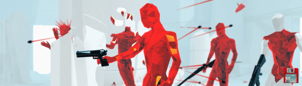

# ENDLESSHOT

## Tabla de contenidos
* [General Info](#general-information)
* [Technologies Used](#technologies-used)
* [Features](#features)
* [Screenshots](#screenshots)
* [Setup](#setup)
* [Room for Improvement](#room-for-improvement)
* [Acknowledgements](#acknowledgements)
* [Contact](#contact)

## General Information
- Computer Grafics (TC3022) Final Project February-June 2021
- Endless FPS Web Game.  

### Developers:
- [Eduardo Gallegos](https://github.com/Eduardogallegos)
- [Pedro Cortes](https://github.com/A01374919)
- [Francisco Javier Zavala](https://github.com/JavierZavala17)
### Professor
- [Octavio Navarro](https://github.com/octavio-navarro)

## Technologies Used
- [ThreeJS](https://threejs.org/)
- [CannonJS](https://github.com/schteppe/cannon.js/)

## Features
- Scene with 3D objects (airplanes, cars, boxes)
- Fisrt Person Character (POV camera)
- 1 type of enemy
- 3 types of weapons (knife, gun and rifle)
    - Main character has the 3 weapons with 0 ammo.
    - Ammo is gained when killing enemies. (Random from 1 to 5)
    - Enemies have just one weapon with unlimited ammo.
- Time moves only when main character moves.

## Screenshots

## Setup
1. Clone the repo:
```bash
$ git clone https://github.com/Eduardogallegos/proyecto-final-graficas.git
```
2. Open the `index.html` file with a web browser. Or use a local development server like [Live Server](https://marketplace.visualstudio.com/items?itemName=ritwickdey.LiveServer)
3. Have fun.

## Room for Improvement
### TODOS:
- Weapons to the enemies
- Ammo logic for main character

### Features on the next release:
- Changes on the scene props.
- Logic to interact with the scene props.
- Hands with weapons for the main character.
- Enemies with animations (run, shoot, die).

## Acknowledgements
- Inspired in [SUPERHOT](https://superhotgame.com/)


- This project was based on [the course repo](https://github.com/octavio-navarro/Computer-Graphics).

## Contact
Created by:
    - [Eduardo](mailto:egallegossolis@gmail.com)
    - [Pedro](mailto:pedro_corsob@outlook.com)
    - [Francisco](mailto:javier_z_t@hotmail.com)
Feel free to contact us!